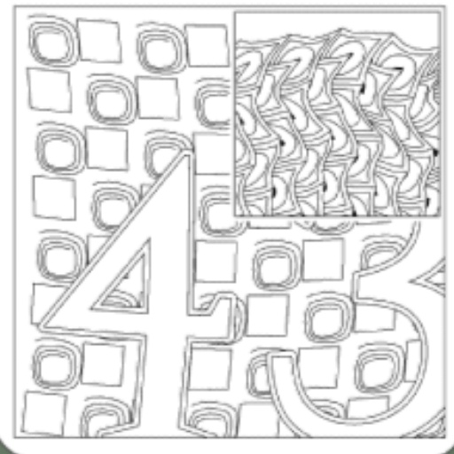

# Work in progress, inconsistent! Do NOT fork (yet).

As of now (15.05.2020) I can't seem to push to a private repository, so this is public.
Just working on the docs now, standby
And now Markor ate most changes of 4 hours..stupid mixed case README.md.

# forU

Assorted Java libs made with/for [APDE](#apde)

- [Ttf](#foruttf) -Truetype font handling 
- [I](#forui) - Simple user interface
- [ClipDraw](#foruclipdraw) - Clipping with arbitrary region 
- [ForTex](forufortex) - Procedural texture generation

----

# forU.Ttf

## Read and render Truetype fonts.

  - Can read fonts with CMAP formats
    - 12 - Full UTF-32 coverage ( Yep, linear-b: 𐂂)
    - 4 -:UTF-16
    - 0 - ASCII
 - Base class [TTFont]( TTFont.md ) without dependencies.
- Wapper class [Ttf]( Ttf.md ) for Processing/Android/APDE convenient use. Allows to 
  - Draw to any `PGraphics` (with Glyph outline stroked!)
  - Create a 2D `PShape` 
  - Create a 3D extruded `PShape` 
  
# forU.I
  
## Simple GUI for development and demos
  
  There often is the need for a simple user interface in a sketch, be it during development or to trigger user actions.
  Available libraries for Processing depend on java.awt etc. or are written in a too modern Java dialect making them impossible to use with [APDE](#apde)
  
  
  forU.I will provide that, offering
  - a basic Button class to trigger actions, ie. call a void whatever() method in your applet when pressed.
  - Switch, Slider, List, ... classes derived from that
  - Simple Text input with automatic Keyboard control (Android only)
  - The Actor class to tie these into a dialog and handle user interaction
  - much more...
  
#### Nothing to declare.
  In its most simple form all you have to do is
  
  ```Java
  import forU.I.*;
  
  void setup(){
     new UI(this, 64); // default text size
     UI.add("hello","world"); // just a plain button
   }
   
 void draw(){
    // your drawing code here
    UI.draw();
}

void mousePressed() {
 // UI needs to know
  if (UI.mousePressed()) return ;
  // your code here, if any.
  return;
}
   
 void world(){ // gets called when the button is pressed
   println("Hello world!");
 }
 
 ```
 
 ----
 Things can get as complex as you want, including popups.
 
 ----
 # Soon to come
 
 ## forU.ForTex 
 
 (will probably get its own lib)
 
 Procedural textures for Android.
 
 
 ## forU.ClipDraw
 
 (Soon)
 
- Clipping with arbitrary regions
- Offset paths (aka. Inflate/deflate/aura)
- Wraps & includes de.lighti.clipper
- ...

## forU.ForZen (work in progress)
- Procedural pattern creation trying to mimic [Zentangle](https://zentangle.com/) drawings.
- Double line elimination 
- optimized GCODE generation 
- use a clothpin and a M3 screw to upgrade your 3D-Printer to a pen plotter.
- now  you see what this lib was created for


 
 # Credits
 
 #### Ketai
 
The methods for opening/closing the soft keyboard and handling  gestures on Android were copied from the [Ketai](https://github.com/ketai/ketai) library by Daniel Sauter. 
 
#### TrueType

See separate credits in [TTFont](TTFont.md)

#### APDE

And of course the incredible [APDE](https://github.com/Calsign/APDE/wiki/Getting-Started)


 
 
 
 
